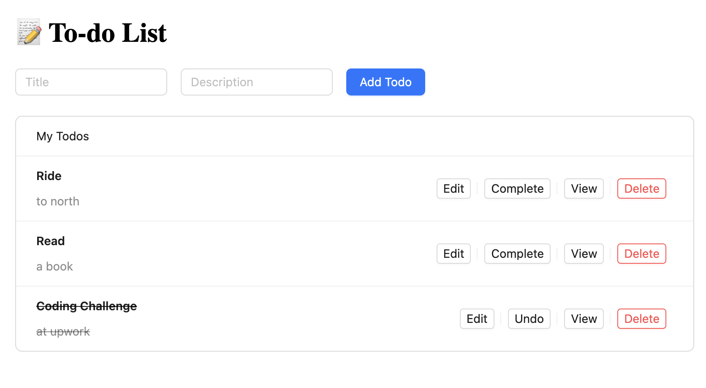

# Todo App made with Nest and Apollo by Kenn

<div align="center">


</div>



```bash
cd nest-backend
npm install
npm run start:dev
```
Go to Backend (NestJS): http://localhost:3000/graphql  

```bash
cd react-frontend
npm install
npm start
```
Go to Frontend (React): http://localhost:3001   

Each app has instructions in readme